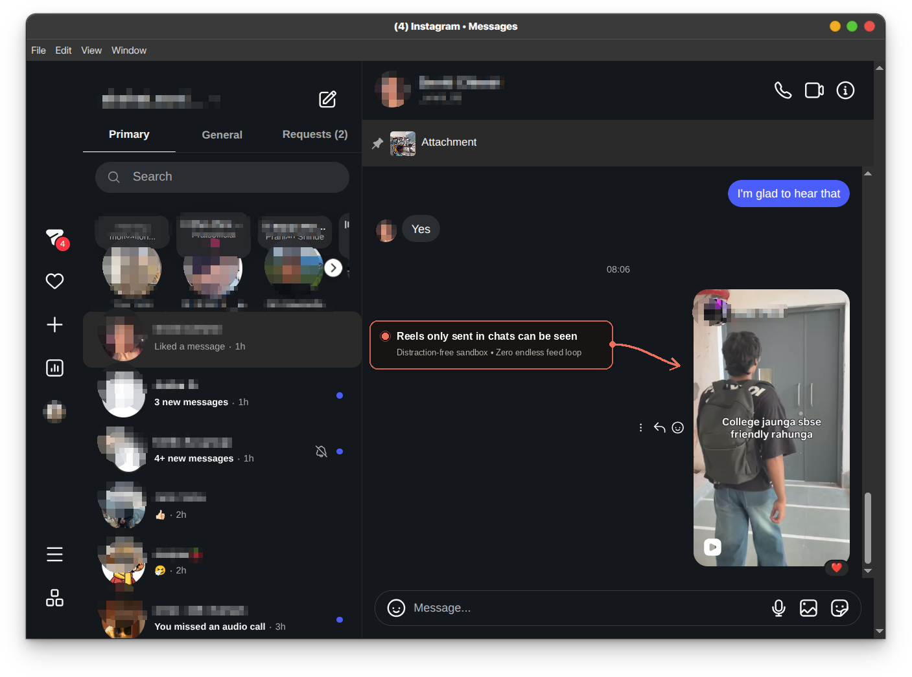
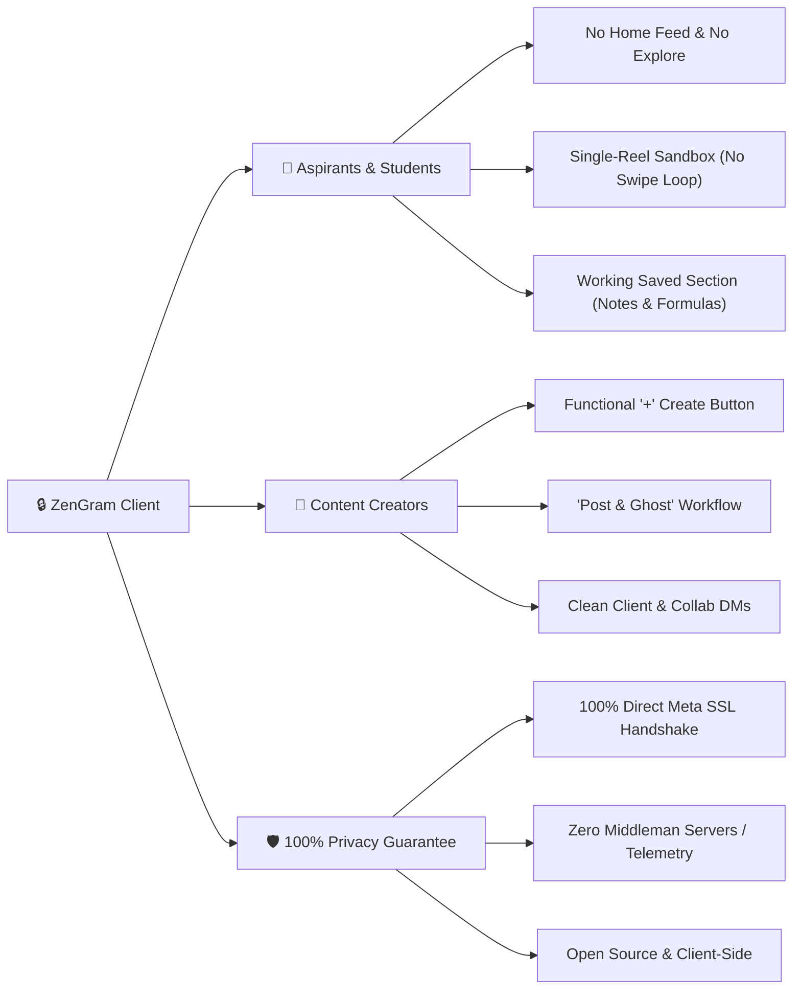

# 🔒 ZenGram: The Distraction-Free Instagram Client for Aspirants & Content Creators

> *Direct Messages, Voice/Video Calls, Saved Formula Sheets, and "Post & Ghost" Creator Publishing — with Zero Algorithmic Traps, Zero Feed, and 100% Client-Side Privacy.*

---



---

## 💡 The Problem: Why Social Media Steals Your Future

Modern social media platforms are no longer communication tools; they are **hyper-optimized dopamine feedback loops**. 

For **competitive exam aspirants** (preparing for GATE, JEE, NEET, UPSC) and **serious content creators**, Instagram presents a toxic dilemma:
1. **You need Instagram:** To coordinate study groups, message mentors and peers, answer client/sponsor inquiries, review bookmarked formula sheets, or publish your work.
2. **Instagram exploits you:** The moment you open the app to check a single message, algorithmic recommendations, red notification badges, and infinite Reels hijack your attention. A 30-second inquiry turns into a 45-minute doom-scroll vortex.

**ZenGram solves this completely.** It strips away the algorithmic Casino, leaving only the purposeful utility: Direct Messages, Hardware-Accelerated Voice/Video Calling, Saved Collections, and focused Creator Publishing.

---

## 🌟 Key Pillars: Who ZenGram Is Built For



---

### 1. 🎯 For Aspirants & Students (Deep Work Focus)
- **Zero Algorithmic Feed:** Navigating to `instagram.com` or clicking the home icon automatically redirects to your Direct Messages inbox (`/direct/inbox/`).
- **No Endless Reels Loop:** The Reels navigation tab is eradicated. If a study partner sends a video or educational reel in your DM chat, ZenGram opens it inside an **isolated single-video sandbox**. When the reel ends, it pauses. There is **no swipe-up for the next video** and **no suggested feed**.
- **Saved Section Fully Accessible:** Your bookmarked revision diagrams, physics notes, and formula sheets (`/username/saved/` and `/p/shortcode/`) open cleanly without feed distractions.
- **Hardware-Accelerated Calling:** WebRTC calling buttons injected directly into chat headers let you hop on voice and video study sessions with peers.

---

### 2. 🎨 For Content Creators: The "Post & Ghost" Workflow
As a creator, your job is to **produce**, not consume. Getting sucked into your own Explore feed while checking analytics or answering inquiries destroys creative flow.

- **Functional `+ Create` Button:** The sidebar `+ Create` button is fully operational. Tap it to trigger Instagram's native modal and file picker to upload photos, carousels, reels, and stories.
- **Post & Ghost:** Publish your content, answer business inquiries or client DMs, and immediately close the client. You never see what anyone else is posting unless they message you directly.
- **Professional Dashboard Access:** View your creator metrics and audience reach without having to scroll past trending algorithmic noise.

---

### 3. 🛡️ The Zero-Data-Theft Guarantee (Total Transparency)

> [!IMPORTANT]
> **ZenGram does NOT collect, store, transmit, or proxy your credentials, cookies, tokens, or messages.**

Many third-party Instagram mod APKs and shady wrappers route user traffic through third-party servers to scrape tokens. ZenGram is built with absolute architectural transparency:
- **100% Client-Side:** ZenGram runs exclusively on your local device. It is a lightweight DOM and route interceptor that suppresses distraction elements.
- **Direct Official Meta Handshake:** Every single HTTPS/SSL network packet travels directly between your browser/app and official Instagram servers (`https://www.instagram.com`).
- **Zero Middleman Servers:** There are no proxies, no logging backends, no analytics trackers, and no telemetry SDKs.
- **Fully Auditable:** Every component—from the desktop Electron wrapper to the browser extension and Android Java WebView—is open-source and readable in plain text.

---

## 📱 Mobile Setup: iPhone vs. Android (What's Best for Society?)

### 🍎 Why Option A (Standalone PWA) is the Best Choice for iPhone
For iOS users, third-party binary patchers (like ReVanced) do not exist, Apple bans sideloading modded apps, and iOS browsers do not support desktop extensions. 

**The Standalone PWA is unequivocally the cleanest, most resilient choice:**
1. Open Safari on your iPhone and visit your hosted ZenGram URL (or open `phone-pwa/index.html`).
2. Tap the **Share** button (box with arrow pointing up) at the bottom.
3. Scroll down and tap **"Add to Home Screen"**.
4. Tap **Add**.

**Why this is a win for society:**
- Launches in full standalone mode with **zero browser address bars**.
- Authentic Instagram login session persists securely in Apple's native WebKit Keychain.
- 100% immune to Instagram app updates that constantly break patched APKs.
- Uses zero extra battery or RAM compared to heavy native background processes.

---

### 🤖 For Android Users: Two Great Choices
1. **Option A (Zero-Install PWA):** Open in Chrome → Tap `⋮` (Menu) → **"Install app"** or **"Add to Home screen"**. Done in 5 seconds.
2. **Option B (Transparent Native Android App):** 
   - Located in [`mobile-android/`](file:///home/akshat/zengram-insta-chat/mobile-android/).
   - Written in 100 lines of standard Android SDK Java ([`MainActivity.java`](file:///home/akshat/zengram-insta-chat/mobile-android/app/src/main/java/com/zengram/chat/MainActivity.java)).
   - Features `WebChromeClient.onShowFileChooser` for creator photo/video uploads and hardware camera/mic permissions for audio/video calling.

---

## 💻 Desktop & PC Setup (Windows, Linux, macOS)

| Platform | Recommended Setup | Launch Command / Method |
| :--- | :--- | :--- |
| **🪟 Windows (10/11)** | **1-Click Batch Launcher** (Uses native Edge app mode or Electron) | Double-click [`ZenGram-Windows.bat`](file:///home/akshat/zengram-insta-chat/ZenGram-Windows.bat) or `zengram.bat` |
| **⚡ Universal (All OS)** | **NPX / Node CLI Runner** (Stdlib, zero config) | `npx zengram` or `npm start` |
| **🐧 Linux** | **Standalone AppImage** (Portable, pre-built, runs on any distro) | `chmod +x ZenGram-x86_64.AppImage && ./ZenGram-x86_64.AppImage` |
| **🍏 macOS** | **Chrome App Mode or NPX** | `npx zengram` |
| **🌐 Browser** | **Unpacked Extension or Userscript** | Load [`web-extension/`](file:///home/akshat/zengram-insta-chat/web-extension/) or install [`zengram.user.js`](file:///home/akshat/zengram-insta-chat/userscript/zengram.user.js) |

---

### Step-by-Step Windows Guide (30 Seconds):
1. Download or clone this repository.
2. Double-click **`ZenGram-Windows.bat`**.
3. **What happens under the hood:**
   - If you have Node/Electron installed, it launches the isolated client window.
   - If you don't have Node installed, it instantly launches Windows' built-in Microsoft Edge in dedicated standalone app mode (`msedge --app=https://www.instagram.com/direct/inbox/ --window-size=1100,800`).
   - Zero terminal knowledge required!

---

### Step-by-Step Linux Guide:
1. Download [`ZenGram-x86_64.AppImage`](file:///home/akshat/zengram-insta-chat/ZenGram-x86_64.AppImage).
2. Make it executable and run:
   ```bash
   chmod +x ZenGram-x86_64.AppImage
   ./ZenGram-x86_64.AppImage
   ```
3. Runs natively with Chromium hardware acceleration and calling enabled on Ubuntu, Debian, Arch, Fedora, and openSUSE.

---

## 🚀 Live Testing & Interactive Web Simulator

You can test the entire workflow (in-chat reels, calling dialogs, friend stories, creator upload triggers, and feed blockers) in your browser:

```bash
# Start the built-in HTTP server
node bin/zengram.js --demo
```
Then open `http://localhost:8080` to experience the distraction-free client live!
