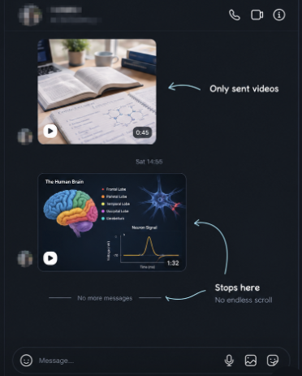

# 🔒 ZenGram — Distraction-Free Instagram Chat Client (Phone & Web)

A minimal, distraction-free Instagram client engineered exclusively for **Direct Messages, in-chat Reels, person-specific Stories, and high-performance Voice & Video Calling**.

<div align="center">
  
  <p><em>▲ <strong>Demonstration:</strong> Notice the curved arrow pointing to the sent reel — only reels sent inside chats are visible in a distraction-free sandbox. Zero infinite explore feeds, zero ads.</em></p>
</div>

---

## 🎯 What ZenGram Solves

| Feature | Standard Instagram Web / App | 🔒 ZenGram Solution |
| :--- | :--- | :--- |
| **Home Feed** | Infinite algorithmic posts, suggested ads | **Completely blocked** (auto-redirects to DMs) |
| **Explore / Discover** | Infinite recommendation rabbit hole | **Completely blocked** |
| **Reels Tab** | Addictive vertical video swipe loop | **Completely blocked** |
| **Reels Sent in Chat** | Clicking opens infinite Reels feed | **Plays inside isolated single-reel sandbox** |
| **Saved Section** | Often distracts with reel discovery | **Clean Access Allowed**: view study notes & diagrams; reels play only in single sandbox |
| **Content Creators** | Feeds distract creators during publishing | **Post & Ghost Allowed**: `/create` path & media uploads work cleanly without feed exposure |
| **Voice & Video Calling** | Disabled / missing on Instagram Web | **Fully enabled** (WebRTC hardware-accelerated calling) |
| **Stories** | Global top tray tempting you to click | **Filtered**: visible **only** for chat partner or profile search |
| **Data Privacy** | 3rd-party clients often steal cookies/tokens | **100% Zero-Data-Collection**: runs locally on device, 0 telemetry, authenticates strictly with official Meta SSL servers |

<div align="center">
  
  <p><em>▲ <strong>In-Chat Single-Reel Sandbox:</strong> Only sent videos play inside thread. Playback halts immediately when finished ("Stops here / No endless scroll").</em></p>
</div>

---

## 📱 How to Use on Mobile (Android & iOS)

Since Instagram updates frequently break third-party binary patchers (like ReVanced), ZenGram provides three resilient, 100% open-source mobile methods:

### Method 1: Zero-Install Standalone PWA (iOS & Android — 15 Seconds)
- **iOS (iPhone):** Open Safari → Visit `https://www.instagram.com/direct/inbox/` → Tap **Share** → **Add to Home Screen** → Name **ZenGram**.
- **Android:** Open Chrome or Brave → Visit `https://www.instagram.com/direct/inbox/` → Tap **Menu ⋮** → **Install app** (or *"Add to Home screen"*).
- Runs fullscreen with zero browser address bars, authenticates via native OS Keychain, and uses zero background battery.

### Method 2: Mobile Browser Userscript (Kiwi Browser / Firefox / Orion)
- **Android:** Install **Kiwi Browser** or **Firefox** → Install **Tampermonkey** → Tap to install [`zengram.user.js`](userscript/zengram.user.js).
- **iOS:** Install **Orion Browser** (App Store) → Add Tampermonkey → Install [`zengram.user.js`](userscript/zengram.user.js).
- Completely strips explore grids and reels tabs with client-side CSS & DOM routing.

### Method 3: Standalone Android APK (Dedicated App)
- Pre-built signed APK: [**⬇️ Download ZenGram.apk (v1.1.0)**](https://github.com/Akshatsoni005/zengram/releases/download/v1.1.0/ZenGram.apk) *(17 KB, Android 7.0+)*
- Source code in [`mobile-android/`](mobile-android/): 100 lines of standard Java ([`MainActivity.java`](mobile-android/app/src/main/java/com/zengram/chat/MainActivity.java)).
- Auto-deflects explore/reels navigation back to `/direct/inbox/`, unlocks WebRTC calling, and supports creator photo/video file uploads.

---

## 💻 How to Use on Web / Desktop

| Platform | Recommended Setup | Download Link / Command |
| :--- | :--- | :--- |
| **🪟 Windows (10/11)** | **1-Click Portable Package** | [⬇️ Download ZenGram-Windows.zip](https://github.com/Akshatsoni005/zengram/releases/download/v1.1.0/ZenGram-Windows.zip) (13 KB) |
| **🐧 Linux** | **Standalone AppImage** | [⬇️ Download ZenGram-x86_64.AppImage](https://github.com/Akshatsoni005/zengram/releases/download/v1.1.0/ZenGram-x86_64.AppImage) (119 MB) |
| **📱 Android** | **Standalone Signed APK** | [⬇️ Download ZenGram.apk](https://github.com/Akshatsoni005/zengram/releases/download/v1.1.0/ZenGram.apk) (17 KB) |
| **⚡ Universal (All OS)** | **NPX / Node CLI Runner** | `npx zengram` or `npm start` |
| **🍏 macOS** | **Chrome App Mode or NPX** | `npx zengram` |
| **🌐 Browser** | **Unpacked Extension or Userscript** | Load [`web-extension/`](web-extension/) or install [`zengram.user.js`](userscript/zengram.user.js) |

### Method 1: 1-Click Windows Launcher (`ZenGram-Windows.zip`)
1. Download [**`ZenGram-Windows.zip`**](https://github.com/Akshatsoni005/zengram/releases/download/v1.1.0/ZenGram-Windows.zip) and extract it.
2. Double-click **`ZenGram-Windows.bat`**.
*Zero setup needed*: If Electron is installed, it runs the full isolated client; otherwise it instantly opens a dedicated standalone app window using Windows' built-in Microsoft Edge!

### Method 2: Standalone Linux AppImage (`ZenGram-x86_64.AppImage`)
1. Download [**`ZenGram-x86_64.AppImage`**](https://github.com/Akshatsoni005/zengram/releases/download/v1.1.0/ZenGram-x86_64.AppImage) (or [`ZenGram-Linux.sh`](https://github.com/Akshatsoni005/zengram/releases/download/v1.1.0/ZenGram-Linux.sh)).
2. Make it executable and run:
```bash
chmod +x ZenGram-x86_64.AppImage
./ZenGram-x86_64.AppImage
```
Self-contained with all dependencies and sandbox switches included.

### Method 3: Universal NPX / NPM Launcher (Windows, Linux, macOS)
Run directly from terminal without manual configuration:
```bash
# Launch ZenGram Desktop Client (Auto-detects Electron or native app mode)
npx zengram
# Or inside this repository:
npm start

# Test the live interactive simulator locally:
npx zengram --demo
```

### Method 5: Chrome / Brave / Edge / Opera Extension (Unpacked)
1. Open your Chromium browser and go to: `chrome://extensions`
2. Toggle **Developer mode** (top-right corner).
3. Click **Load unpacked**.
4. Select the directory:
   `/home/akshat/zengram-insta-chat/web-extension`
5. Visit [instagram.com](https://www.instagram.com).
   - ZenGram automatically locks to Direct Messages (`/direct/inbox/`) and Saved section (`/username/saved/`).
   - Feed and reels navigation items are removed.
   - Calling buttons are injected in your DM chat headers.

### Method 6: Tampermonkey / Violentmonkey Userscript (1-Click)
1. Install the **Tampermonkey** or **Violentmonkey** extension in your browser.
2. Create a new script and paste the contents of:
   `/home/akshat/zengram-insta-chat/userscript/zengram.user.js`
3. Save and open Instagram.

---

## 🔬 Testing the Live Interactive Simulator

We have created an interactive simulator demonstrating all behaviors (Phone view vs Desktop view, In-Chat Reel Sandboxing, Calling, Stories filtering, and feed blockers):

```bash
# Start a quick local web server to test the simulator
python3 -m http.server 8080 --directory /home/akshat/zengram-insta-chat/preview-demo
```
Then open `http://localhost:8080` in your web browser!

---

## 📂 Project Structure

```
zengram-insta-chat/
├── README.md               # This documentation
├── core/
│   ├── zengram-engine.js   # Core route guard, reel sandboxing, call injector, story filter
│   └── zengram-style.css   # Distraction-free CSS stylesheet
├── web-extension/          # Manifest V3 browser extension for Chrome, Brave, Edge, Kiwi
│   ├── manifest.json
│   ├── background.js       # Network-level redirect interceptor
│   ├── content.js
│   ├── popup/              # Extension status popup
│   └── icons/              # Extension icons
├── userscript/
│   └── zengram.user.js     # Single-file Tampermonkey/Violentmonkey script
├── desktop/                # Electron standalone desktop application
│   ├── package.json
│   └── main.js             # Window & WebRTC call permissions manager
├── mobile-android/         # Native Android WebView app with WebRTC video/audio calling
│   └── app/src/main/
│       ├── AndroidManifest.xml
│       └── java/com/zengram/chat/MainActivity.java
└── preview-demo/           # Interactive live web demo to test all features
    ├── index.html
    ├── demo.css
    └── demo.js
```
